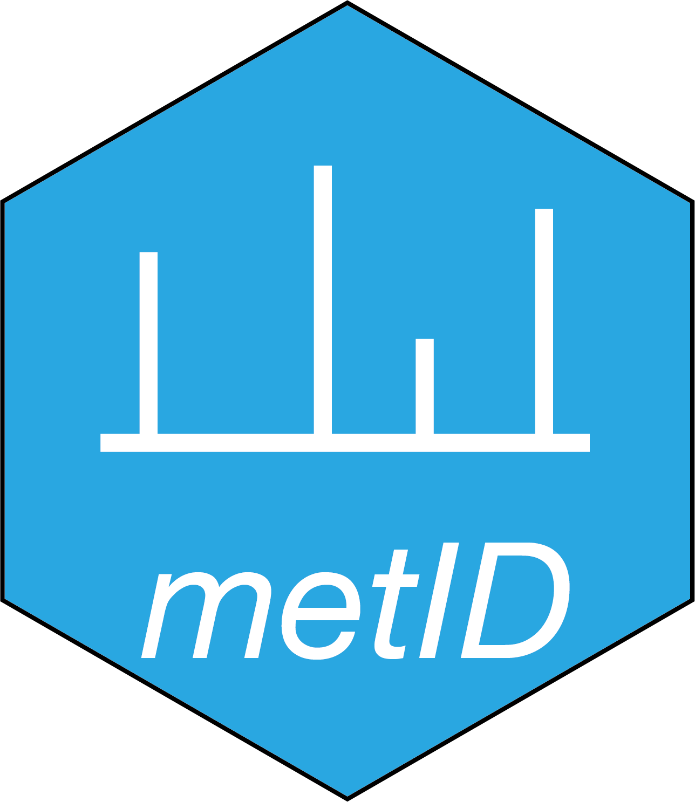

<!-- README.md is generated from README.Rmd. Please edit that file -->

# metid 

[](https://cran.r-project.org/package=metid)
[](https://github.com/tidymass/metid)
[](https://cran.r-project.org/package=metid)
[](https://www.tidyverse.org/lifecycle/#experimental)


`metid` is a part of [tidymass](https://tidymass.github.io/tidymass/)

-------

# About

`metid` is a R package which is used for metabolite identification based
on in-house database and public database based on accurate mass (m/z),
retention time (RT) and/or MS2 spectra.


# Installation

You can install `metid` from [GitLab](https://gitlab.com/tidymass/metid)

``` r
if(!require(remotes)){
install.packages("remotes")
}
remotes::install_gitlab("tidymass/metid")
```
or [Github](https://github.com/tidymass/metid)

``` r
remotes::install_github("tidymass/metid")
```

`metid` is a part of `tidymass`, so you can also install it by installing [`tidymass`](https://www.tidymass.org/).

# Usage

Please see the `Help documents` page to get the instruction of `metid`.

## Need help?

If you have any questions about `metid`, please don’t hesitate to email me (<shenxt@stanford.edu>).

<i class="fa fa-weixin"></i>
[shenzutao1990](https://www.shenxt.info/files/wechat_QR.jpg)

<i class="fa fa-envelope"></i> <shenxt@stanford.edu>

<i class="fa fa-twitter"></i>
[Twitter](https://twitter.com/JasperShen1990)

<i class="fa fa-map-marker-alt"></i> 
[M339, Alway Buidling, Cooper Lane, Palo Alto, CA 94304](https://www.google.com/maps/place/Alway+Building/@37.4322345,-122.1770883,17z/data=!3m1!4b1!4m5!3m4!1s0x808fa4d335c3be37:0x9057931f3b312c29!8m2!3d37.4322345!4d-122.1748996)

# Citation

If you use `metid` in your publications, please cite this paper:

1. Xiaotao Shen, Si Wu, Liang Liang, Songjie Chen, Kevin Contrepois, Zheng-Jiang Zhu\*, Michael Snyder\* (Corresponding Author). metID: A R package for automatable compound annotation for LC−MS-based data. Bioinformatics, btab583, [https://doi.org/10.1093/bioinformatics/btab583](https://doi.org/10.1093/bioinformatics/btab583)

2. Shen, X., Yan, H., Wang, C. et al. TidyMass an object-oriented reproducible analysis framework for LC–MS data. Nat Commun 13, 4365 (2022). [Weblink](https://www.nature.com/articles/s41467-022-32155-w)

Thanks very much!
