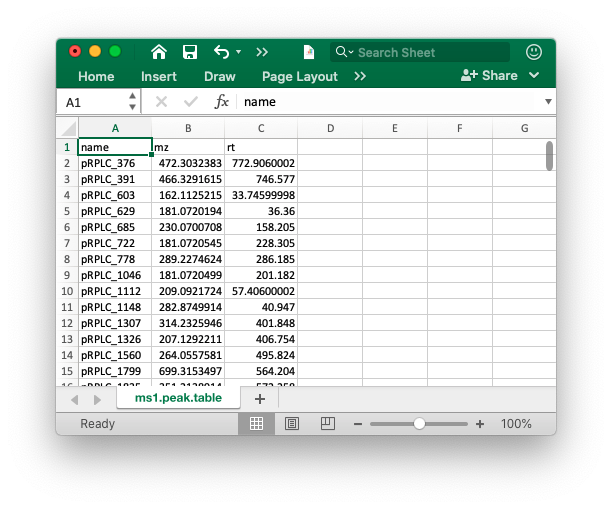

```{r, include=FALSE}
knitr::opts_chunk$set(
  collapse = TRUE,
  comment = "#>",
  out.width = "100%"
)
```

***

# **MS1 data preparation**

The peak table must contain "name" (peak name), "mz" (mass to charge ratio) and "rt" (retention time, unit is second). It can be from any data processing software (XCMS, MS-DIAL and so on).



# **Database**

The database must be generated using `constructDatabase()` function. You can also use the public databases we provoded [here](https://github.com/jaspershen/demoData/tree/master/inst/ms2_database).

# **Data organization**

Place the MS1 peak table and databases which you want to use in one folder like below figure shows:


# **Run `identify_metabolites()` function**

We use the demo data in `metid` package to show how to use `metid` to identify metabolites without MS2 spectra. 

## **Load demo data**

First we load the MS1 peak and database from `metid` package and then put them in a `example` folder.

```{r,eval = TRUE, warning=FALSE, message=FALSE,R.options="",cache=TRUE}
library(metid)
library(tidyverse)
```

```{r,eval = TRUE,warning=FALSE, message=FALSE,R.options="",cache=TRUE}
##create a folder named as example
path <- file.path(".", "example")
dir.create(path = path, showWarnings = FALSE)

##get MS1 peak table from metid
ms1_peak <- system.file("ms1_peak", package = "metid")
file.copy(from = file.path(ms1_peak, "ms1.peak.table.csv"), 
          to = path, overwrite = TRUE, recursive = TRUE)

##get database from metid
data("snyder_database_rplc0.0.3", package = "metid")
save(snyder_database_rplc0.0.3, file = file.path(path, "snyder_database_rplc0.0.3"))
```

Now in your `./example`, there are two files, namely `ms1.peak.table.csv` and `msDatabase_rplc_0.0.2`, respectively.

## Only use m/z for metabolite identification

First, we only use m/z for metabolite identification.

```{r,eval = TRUE,warning=FALSE, message=FALSE,R.options="",cache=TRUE}
annotate_result1 <- 
  identify_metabolites(ms1.data = "ms1.peak.table.csv", 
                       ms1.match.ppm = 15, 
                       rt.match.tol = 1000000, 
                       polarity = "positive", 
                       column = "rp", 
                       path = path, 
                       candidate.num = 3,
                       database = "snyder_database_rplc0.0.3", 
                       threads = 5)
```

> Note: because here we only want to use m/z for metabolite identification, so please set `rt.match.tol` (second) > 10,000, for example '1000000' here, so the RT will not be used for filtering.

Other parameters:

* `ms1.data`: The ms1 peak table name.

* `ms1.match.ppm`: MS1 match tolerance (ppm).

* `polarity`: positive or negative.

* `column`: hilic or rp.

* `path`: Where are your data placaed? 

* `candidate.num`: The candidate number for each peak.

* `database`: The database name or database.

* `threads`: How many threads you want to use.

The return result `annotate_result1` is a `metIdentifyClass` object, you can directory get the brief information by print it in console:


```{r,eval = TRUE,warning=FALSE, message=FALSE,R.options="",cache=TRUE}
annotate_result1
```

**Note:** 

> now we can also provide "databaseClass" object for "database" argument. For example: we load the database first.

```{r,eval = TRUE,warning=FALSE, message=TRUE,R.options="",cache=TRUE}
snyder_database_rplc0.0.3
```

> Then we can directory provide this database to `identify_metabolites()`:

```{r,eval = TRUE,warning=FALSE, message=FALSE,R.options="",cache=TRUE}
annotate_result2 <- 
  identify_metabolites(ms1.data = "ms1.peak.table.csv", 
                       ms1.match.ppm = 15, 
                       rt.match.tol = 1000000, 
                       polarity = "positive", 
                       column = "rp", 
                       path = path, 
                       candidate.num = 3,
                       database = snyder_database_rplc0.0.3, 
                       threads = 5)
```

> But what should be noticed is that it have different name for database in the final result:

```{r,eval = TRUE,warning=FALSE, message=FALSE,R.options="",cache=TRUE}
annotate_result1@database
```

```{r,eval = TRUE,warning=FALSE, message=FALSE,R.options="",cache=TRUE}
annotate_result2@database
```

> It is because that if you give the `databaseClass`, so `identify_metabolites` can know the name of database, if just use the `source` and `version` as the name for database.

```{r,eval = TRUE,warning=FALSE, message=FALSE,R.options="",cache=TRUE}
paste(snyder_database_rplc0.0.3@database.info$Source,
      snyder_database_rplc0.0.3@database.info$Version, 
      sep = "_")

```

## Only use m/z and RT for metabolite identification

Here we set RT tolerance (`rt.match.tol`) as 30 s.

```{r,eval = TRUE,warning=FALSE, message=FALSE,R.options="",cache=TRUE}
annotate_result2 <- 
  identify_metabolites(ms1.data = "ms1.peak.table.csv", 
                       ms1.match.ppm = 15, 
                       rt.match.tol = 30, 
                       polarity = "positive", 
                       column = "rp", 
                       path = path, 
                       candidate.num = 3,
                       database = "snyder_database_rplc0.0.3", 
                       threads = 5)
```

# Get detailed annotation information

After get the `annotation_result`, we can get the detailed information from it.

## Get the processing parameters

We can use `get_parameters()` function to get the detailed parameters. This is very useful for reproductive analysis for data analysis.

```{r,eval = TRUE,warning=FALSE, message=FALSE,R.options="",cache=TRUE}
metid::get_parameters_metid(annotate_result1)
```

```{r,eval = TRUE,warning=FALSE, message=FALSE,R.options="",cache=TRUE}
metid::get_parameters_metid(annotate_result2)
```

## Check what peaks with annotations

Use `which_has_identification()` function to get what peaks have annotions.

```{r,eval = TRUE,warning=FALSE, message=FALSE,R.options="",cache=TRUE}
which_has_identification(annotate_result1) %>% 
  head()
```

> Because there are no ms2 data, so the peaks have no MS2 spectra.

## Get the identification table

We can use `get_identification_table()` to get the identification table. 

```{r,eval = TRUE,warning=FALSE, message=FALSE,R.options="",cache=TRUE}
table1 <- 
  get_identification_table(annotate_result1, 
                           candidate.num = 3,
                           type = "old")
table1
```

The `type` is set as `old`. It means the identifications for each peak is shown as one character and seperated by `{}`. And the order is sorted by `Total score`.

You can also set `type` as `new` to get another style.

```{r,eval = TRUE,warning=FALSE, message=FALSE,R.options="",cache=TRUE}
table2 <- 
  get_identification_table(annotate_result1, candidate.num = 3,
                           type = "new")
table2
```

If you only want to keep one cancidate for each peak. Please set `candiate.num` as 1.

```{r,eval = TRUE,warning=FALSE, message=FALSE,R.options="",cache=TRUE}
table2 <- 
  get_identification_table(annotate_result1, candidate.num = 2,
                           type = "new")
table2
```

## Get the identification information for single peak

We can use `get_iden_info()` function to get the detailed information for a sinlge peak. Because it gets the information from the database, so this function need provide the database.

First, we need to know what peaks have annotations.


```{r,eval = TRUE,warning=FALSE, message=FALSE,R.options="",cache=TRUE}
which_has_identification(annotate_result1) %>% 
  head()
```


Then we can get the annotation for peak `pRPLC_376` use `get_iden_info()` function.

```{r,eval = TRUE,warning=FALSE, message=FALSE,R.options="",cache=TRUE}
get_iden_info(object = annotate_result1, 
              which.peak = "pRPLC_376", 
              database = snyder_database_rplc0.0.3)
```

We can get the detailed information for metabolites in database.


## Filter identifications 

After we get the annotation result use `identify_metabolites()` function. We can also use `filter_identification()` function to filter annotations based on m/z, rt and MS2 match tolerance.

```{r,eval = TRUE,warning=FALSE, message=FALSE,R.options="",cache=TRUE}
annotate_result2_2 <- 
  filter_identification(object = annotate_result2, 
                        rt.match.tol = 5)
```

```{r,eval = TRUE,warning=FALSE, message=FALSE,R.options="",cache=TRUE}
annotate_result2_2
```

```{r,eval = TRUE,warning=FALSE, message=FALSE,R.options="",cache=TRUE}
annotate_result2
```

# **Session information**

```{r,eval=TRUE,warning=FALSE, R.options="", message=FALSE, cache=TRUE}
sessionInfo()
```