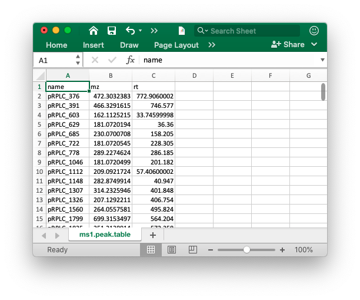
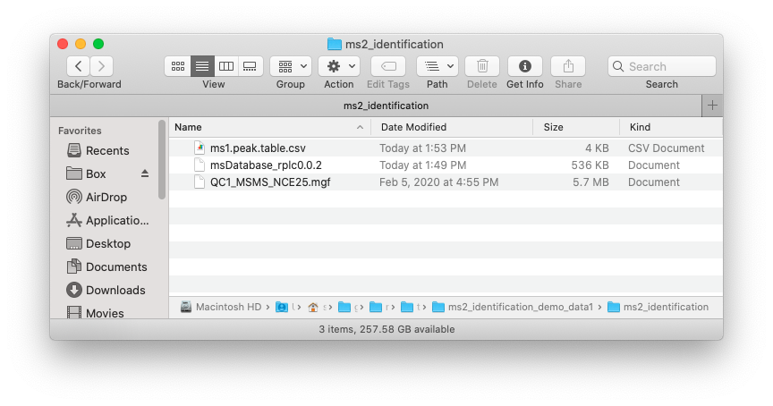
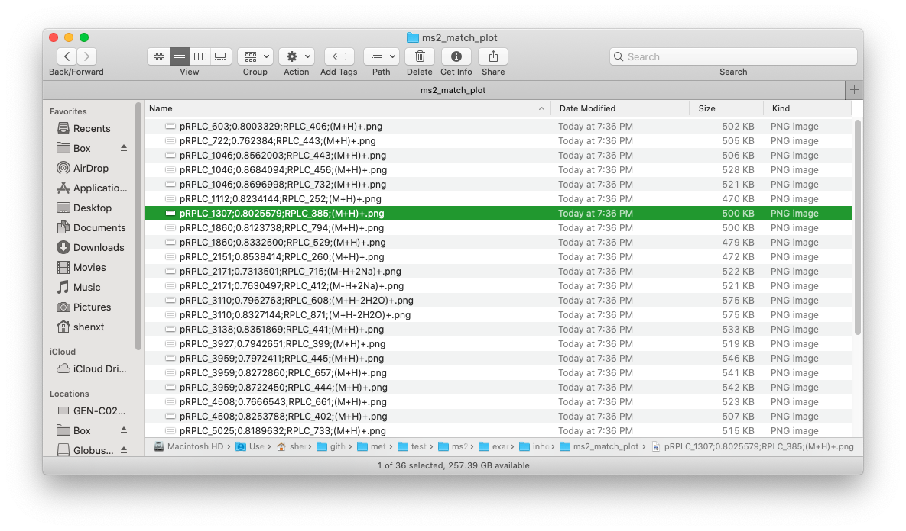

```{r, include=FALSE}
knitr::opts_chunk$set(
  collapse = TRUE,
  comment = "#>",
  out.width = "100%"
)
```

***

# **MS1 data preparation**

The peak table must contain "name" (peak name), "mz" (mass to charge ratio) and "rt" (retention time, unit is second). It can be from any data processing software (XCMS, MS-DIAL and so on).



# MS2 data preparation

The raw MS2 data from DDA or DIA should be transfered to msp, mgf or mzXML format files using [ProteoWizard software](http://proteowizard.sourceforge.net/).

# **Database**

The database must be generated using `constructDatabase()` function. You can also use the public databases we provoded [here](https://github.com/jaspershen/demoData/tree/master/inst/ms2_database).

# Data organization

Place the MS1 peak table, MS2 data and database which you want to use in one folder like below figure shows:



# **Run `identify_metabolites()` function**

We use the demo data in `metid` package to show how to use `metid` to identify metablite without MS2 spectra. Here, we use the in-house database from Michael Snyder lab (`snyder_database_rplc0.0.3`).

> In-house database
The in-house database in our lab were provided, with RPLC and HILIC mode RT information. They were acquired using Thermo Fisher QE-plus. However, the LC system may be different with your experiments, so if you want to use our in-house database for metabolite identification, please set `rt.match.tol` as 100000000 (no limitation). The in-house database can be downloaded in my [github](https://github.com/tidymass/metid/tree/master/data).

## **Load demo datas**

First we load the MS1 peak, MS2 data and database from `metid` package and then put them in a `example` folder.

```{r,eval = TRUE,warning=FALSE, message=FALSE,R.options="",cache=FALSE}
library(metid)
library(tidyverse)
```

```{r,eval = TRUE,warning=FALSE, message=FALSE,R.options="",cache=FALSE}
#creat a folder nameed as example
path <- file.path(".", "example")
dir.create(path = path, showWarnings = FALSE)

##get MS1 peak table from metid
ms1_peak <- system.file("ms1_peak", package = "metid")
file.copy(from = file.path(ms1_peak, "ms1.peak.table.csv"), 
          to = path, overwrite = TRUE, recursive = TRUE)

##get MS2 data from metid
ms2_data <- system.file("ms2_data", package = "metid")
file.copy(from = file.path(ms2_data, "QC1_MSMS_NCE25.mgf"), 
          to = path, overwrite = TRUE, recursive = TRUE)

##get database from metid
database <- system.file("ms2_database", package = "metid")

data("snyder_database_rplc0.0.3", package = "metid")
save(snyder_database_rplc0.0.3, file = file.path(path, "snyder_database_rplc0.0.3"))
```

Now in your `./example`, there are three files, namely `ms1.peak.table.csv`, `QC1_MSMS_NCE25.mgf` and `snyder_database_rplc0.0.3`.

## Use m/z, RT and MS2 for metabolite identification

```{r,eval = TRUE,warning=FALSE, message=FALSE,R.options="",cache=FALSE}
annotate_result3 <- 
  identify_metabolites(ms1.data = "ms1.peak.table.csv", 
                       ms2.data = c("QC1_MSMS_NCE25.mgf"), 
                       ms2.match.tol = 0.5, 
                       ce = "all",
                       ms1.match.ppm = 15, 
                       rt.match.tol = 30, 
                       polarity = "positive", 
                       column = "rp", 
                       path = path, 
                       candidate.num = 3,
                       database = "snyder_database_rplc0.0.3", 
                       threads = 3)
```

> Note: You can also provide more than one MS2 data. Just provide them to `ms2.data` as a vector.

Most of the parameters are same with in `Annotate metabolites according to MS1 database using metid package`. 

Some parameters for MS2 matching:

* `ms2.data`: The ms2 data. 

* `ce`: The collision energy of spectra used for matching. Set as `all` to use all the spectra.

* `ms2.match.tol`: The MS2 similarity tolerance for peak and database metabolite match. The MS2 similarity refers to the algorithm from [MS-DIAl](https://www.nature.com/articles/nmeth.3393). So if you want to know more information about it, please read this publication.

$$MS2\;Simlarity\;Score\;(SS) = Fragment\;fraction*Weight_{fraction} + Dot\;product(forward) * Weight_{dp.reverse}+Dot\;product(reverse)*Weight_{dp.reverse}$$

* `fraction.weight`: The weight for fragment match fraction.

$$Fragment\;match\;fraction = \dfrac{Match\;fragement\;number}{All\;fragment\;number}$$

* `dp.forward.weight`: The weight for dot product (forward)

* `dp.forward.weight`: The weight for dot product (forward)

$$Dot\;product = \dfrac{\sum(wA_{act.}wA_{lib})^2}{\sum(wA_{act.})^2\sum(wA_{lib})^2}with\;w =1/(1+\dfrac{A}{\sum(A-0.5)})$$

The return result `annotate_result3` is a `metIdentifyClass` object, you can directory get the brief information by print it in console:

```{r,eval = TRUE,warning=FALSE, message=FALSE,R.options="",cache=FALSE}
annotate_result3
```

# Get detailed annotation information

Most of the detailed annotation information are same with `Annotate metabolites according to MS1 database using metid package`. 


# **Get MS2 spectra match plot**

You can also use `ms2plot()` function to output the MS2 specra match plot for one, multiple or all peaks.

## Output one MS2 spectra match plot.

```{r, eval = TRUE,warning=FALSE,message=FALSE,R.options="",cache=FALSE}
##which peaks have identifications
which_has_identification(annotate_result3) %>% 
  head()
```

Becase we need the information from database, so we need to load database first.

```{r, eval = TRUE,warning=FALSE,message=FALSE,R.options="",cache=FALSE}
load(file.path(path, "snyder_database_rplc0.0.3"))
```

```{r, eval = TRUE,warning=FALSE,message=FALSE,R.options="",cache=FALSE}
ms2.plot1 <- ms2plot(object = annotate_result3,
                     database = snyder_database_rplc0.0.3,
                     which.peak = "pRPLC_603")
ms2.plot1
```


> You can also output interactive MS2 spectra match plot by setting `interaction.plot` as TRUE.

```{r, eval = TRUE,warning=FALSE,message=FALSE,R.options="",cache=FALSE}
##which peaks have identification
ms2.plot2 <- ms2plot(object = annotate_result3,
                     database = snyder_database_rplc0.0.3,
                     which.peak = "pRPLC_603", 
                     interaction.plot = TRUE)
ms2.plot2
```

Some time you want to get the dark theme. Because the plot from `ms2plot` is a `ggplot2` object, so you can just set the theme as 'dark theme'.

```{r, eval = TRUE,warning=FALSE,message=FALSE,R.options="",cache=FALSE}
ms2.plot1 <- ms2plot(object = annotate_result3,
                     database = snyder_database_rplc0.0.3,
                     which.peak = "pRPLC_603", 
                     col.exp = "white")
ms2.plot1_2 <- 
  ms2.plot1 +
  ggdark::dark_theme_bw()

ms2.plot1_2
```

Just use `plotly` to convert it to interactive plot.

```{r, eval = TRUE,warning=FALSE,message=FALSE,R.options="",cache=FALSE}
ms2.plot1_2 %>% 
  plotly::ggplotly()
```

## Output multiple or all MS2 spectra match plots

You can set the `which.peak` as a vector of peak names to output multiple peaks MS2 match plot, or set it as `all` to output all MS2 spectra match plots.

For example, if we want to output all the MS2 spectra match plots:

```{r, eval=FALSE,warning=FALSE,message=FALSE,R.options="",cache=FALSE}
ms2plot(
  object = annotate_result3,
  database = snyder_database_rplc0.0.3,
  which.peak = "all",
  path = file.path(path, "inhouse"), 
  threads = 3
)
```

Then all the MS2 spectra match plots will be output in the "inhouse" folder.



# **Session information**

```{r,eval=TRUE,warning=FALSE, R.options="", message=FALSE, cache=TRUE}
sessionInfo()
```