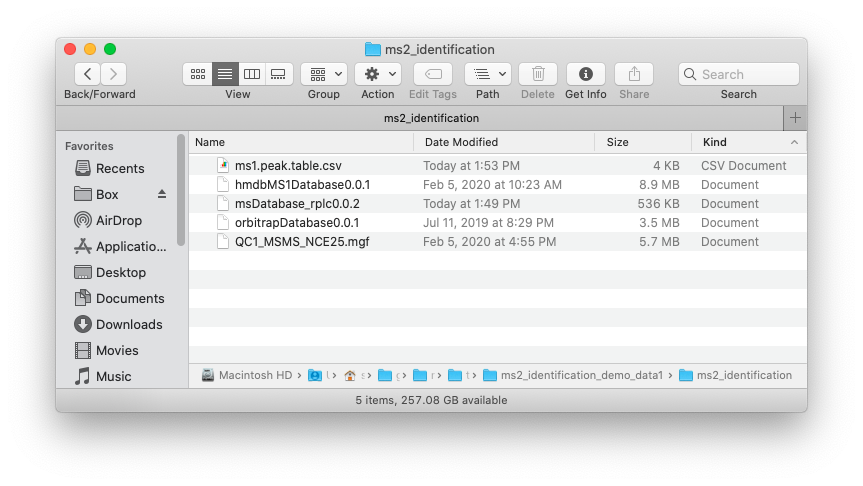

```{r, include=FALSE}
knitr::opts_chunk$set(
  collapse = TRUE,
  comment = "#>",
  out.width = "100%"
)
```

*** 

Some time we have multiple databases, so we can use `identify_metabolite_all()` functions to identify metabolites using multiple database.

# **MS1 data preparation**

The peak table must contain "name" (peak name), "mz" (mass to charge ratio) and "rt" (retention time, unit is second). It can be from any data processing software (XCMS, MS-DIAL and so on).


# MS2 data preparation

The raw MS2 data from DDA or DIA should be transfered to msp, mgf or mzXML format files using [ProteoWizard software](http://proteowizard.sourceforge.net/).

# **Database**

The database must be generated using `construct_database()` function. Here we use the databases in `metid` packages. 

* `snyder_database_rplc0.0.3`: A in-house database, it contains m/z, RT and MS2 spectra information.

* `orbitrap_database0.0.3`: A public database from `MassBank`. It contains m/z and MS2 spectra information.

* `hmdb_ms1_database0.0.3`: A public database from `HMDB`, only contains m/z information.

# Data organization

Place the MS1 peak table, MS2 data and databases which you want to use in one folder like below figure shows:



# **Run `identify_metabolite_all()` function**

We use the demo data in `metid` package.

# **Load demo data**

First we load the MS1 peak, MS2 data and databases from `metid` package and then put them in a `example` folder.


```{r,eval = FALSE,warning=FALSE, message=FALSE,R.options="",cache=TRUE}
library(metid)
library(tidyverse)
```


```{r eval = FALSE, message=FALSE, warning=FALSE, message=FALSE, cache=TRUE, R.options=""}
##creat a folder nameed as example
path <- file.path(".", "example")
dir.create(path = path, showWarnings = FALSE)

##get MS1 peak table from metid
ms1_peak <- system.file("ms1_peak", package = "metid")
file.copy(
  from = file.path(ms1_peak, "ms1.peak.table.csv"),
  to = path,
  overwrite = TRUE,
  recursive = TRUE
)

##get MS2 data from metid
ms2_data <- system.file("ms2_data", package = "metid")
file.copy(
  from = file.path(ms2_data, "QC1_MSMS_NCE25.mgf"),
  to = path,
  overwrite = TRUE,
  recursive = TRUE
)

##get databases from metid
data("snyder_database_rplc0.0.3")
data("orbitrap_database0.0.3")

save(snyder_database_rplc0.0.3, file = file.path(path, "snyder_database_rplc0.0.3"))
save(orbitrap_database0.0.3, file = file.path(path, "orbitrap_database0.0.3"))
```

Now in your `./example`, there are files files, namely `ms1.peak.table.csv`, `QC1_MSMS_NCE25.mgf` and three databases.

## Set parameter list

We need to use `identify_metabolites_params()` functions to set parameter list for each database.

```{r,eval = FALSE,warning=FALSE, message=TRUE,R.options="",cache=TRUE}
param1 <-
  identify_metabolites_params(
    ms1.match.ppm = 15,
    rt.match.tol = 15,
    polarity = "positive",
    ce = "all",
    column = "rp",
    total.score.tol = 0.5,
    candidate.num = 3,
    threads = 3,
    database = "snyder_database_rplc0.0.3"
  )

param2 <- identify_metabolites_params(
  ms1.match.ppm = 15,
  rt.match.tol = 15,
  polarity = "positive",
  ce = "all",
  column = "rp",
  total.score.tol = 0.5,
  candidate.num = 3,
  threads = 3,
  database = "orbitrap_database0.0.3"
)

param3 <- identify_metabolites_params(
  ms1.match.ppm = 15,
  rt.match.tol = 15,
  polarity = "positive",
  ce = "all",
  column = "rp",
  total.score.tol = 0.5,
  candidate.num = 3,
  threads = 3,
  database = "hmdb_ms1_database0.0.3"
)
```

> Note: You can set different parametes for each database.

## Metabolite identification

All the parameters for three databases should be provided to `parameter.list`.

```{r,eval = FALSE,warning=FALSE, message=TRUE,R.options="",cache=TRUE}
result <- identify_metabolite_all(
  ms1.data = "ms1.peak.table.csv",
  ms2.data = "QC1_MSMS_NCE25.mgf",
  parameter.list = c(param1, param2, param3),
  path = path
)
```

> Note: `result` is a list, and each element is a `metIdentifyClass` object. So you can use the functions for `metIdentifylass` object to process it.

## Integrate annotation results from different databases

After we get the annotation result list, we then can integrate the annotation results from different databases. 

For `snyder_database_rplc0.0.3`, the annotaiton results are `Level 1` according to MSI.

```{r,eval = FALSE,warning=FALSE, message=TRUE,R.options="",cache=TRUE}
result[[1]]
```

Then get the annotation table.

```{r,eval = FALSE,warning=FALSE, message=TRUE,R.options="",cache=TRUE}
annotation_table1 <-
  get_identification_table(result[[1]], type = "new", candidate.num = 1)
annotation_table1 %>%
  head()
```

For `orbitrap_database0.0.3`, the annotaiton results are `Level 2` according to MSI.

```{r,eval = FALSE,warning=FALSE, message=TRUE,R.options="",cache=TRUE}
result[[2]]
```

Then get the annotation table.

```{r,eval = FALSE,warning=FALSE, message=TRUE,R.options="",cache=TRUE}
annotation_table2 <-
  get_identification_table(result[[2]], type = "new", candidate.num = 1)
annotation_table2 %>%
  head()
```


For `hmdb_ms1_database0.0.3`, the annotaiton results are `Level 3` according to MSI.

```{r,eval = FALSE,warning=FALSE, message=TRUE,R.options="",cache=TRUE}
result[[3]]
```

Then get the annotation table.

```{r,eval = FALSE,warning=FALSE, message=TRUE,R.options="",cache=TRUE}
annotation_table3 <-
  get_identification_table(result[[3]], type = "new", candidate.num = 1)

annotation_table3 %>%
  head()
```

Then we should combine them together:

```{r,eval = FALSE,warning=FALSE, message=TRUE,R.options="",cache=TRUE}
annotation_table1 <-
  annotation_table1 %>%
  dplyr::filter(!is.na(Compound.name))

dim(annotation_table1)

annotation_table1 <-
  data.frame(annotation_table1,
             Level = 1,
             stringsAsFactors = FALSE)
```

```{r,eval = FALSE,warning=FALSE, message=TRUE,R.options="",cache=TRUE}
annotation_table2 <-
  annotation_table2 %>%
  dplyr::filter(!is.na(Compound.name))

dim(annotation_table2)

annotation_table2 <-
  data.frame(annotation_table2,
             Level = 2,
             stringsAsFactors = FALSE)
```

```{r,eval = FALSE,warning=FALSE, message=TRUE,R.options="",cache=TRUE}
annotation_table3 <- 
  annotation_table3 %>% 
  dplyr::filter(!is.na(Compound.name))

dim(annotation_table3)

annotation_table3 <- 
  data.frame(annotation_table3, 
             Level = 3, 
             stringsAsFactors = FALSE)
```


If one peak have annotation from three different database, we only contains the annotations with higher confidence.

```{r,eval = FALSE,warning=FALSE, message=TRUE,R.options="",cache=TRUE}
annotation_table2 <- 
  annotation_table2 %>% 
  dplyr::filter(!(name %in% annotation_table1$name))

annotation_table <- 
  rbind(annotation_table1,
        annotation_table2)
```

```{r,eval = FALSE,warning=FALSE, message=TRUE,R.options="",cache=TRUE}
annotation_table3 <- 
  annotation_table3 %>% 
  dplyr::filter(!(name %in% annotation_table$name))

annotation_table <- 
  rbind(annotation_table,
        annotation_table3)
```

The `annotation_table` is the final annotation table.

Then we can output it as `csv` file.

```{r,eval = FALSE,warning=FALSE, message=TRUE,R.options="",cache=TRUE}
readr::write_csv(annotation_table,file = file.path(path, "annotation_table.csv"))
```


# **Session information**

```{r,eval=TRUE,warning=FALSE, R.options="", message=FALSE, cache=TRUE}
sessionInfo()
```
